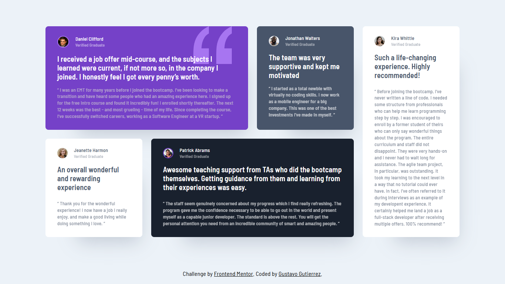

# Frontend Mentor - Testimonials grid section solution

This is a solution to the [Testimonials grid section challenge on Frontend Mentor](https://www.frontendmentor.io/challenges/testimonials-grid-section-Nnw6J7Un7). Frontend Mentor challenges help you improve your coding skills by building realistic projects.

## Table of contents

- [Overview](#overview)
  - [The challenge](#the-challenge)
  - [Screenshot](#screenshot)
  - [Links](#links)
- [My process](#my-process)
  - [Built with](#built-with)
  - [What I learned](#what-i-learned)
  - [Useful resources](#useful-resources)
- [Author](#author)

## Overview

### The challenge

Users should be able to:

- View the optimal layout for the site depending on their device's screen size

### Screenshot

### Links

- Solution URL: [Add solution URL here](https://your-solution-url.com)
- Live Site URL: [Testimonials Grid Section](https://gustavo2023.github.io/testimonials-grid-section/)

## My process

### Built with

- Semantic HTML5 markup
- CSS custom properties
- Flexbox
- CSS Grid
- Mobile-first workflow

### What I learned

- Learned more about CSS Grid by defining a single-column grid layout for mobile devices and a more complex grid layout for larger screens using media queries.
- Used `grid-template-areas` to define named grid areas, making it easier to control the placement of grid items.

### Useful resources

- [An Interactive Guide to CSS Grid](https://www.joshwcomeau.com/css/interactive-guide-to-grid/) - This guide helped me understand the basics of CSS Grid in a very easy way. It's very useful to anyone who doesnt have much experience working with grid layouts.
- [Learn CSS Grid the easy way](https://www.youtube.com/watch?v=rg7Fvvl3taU&t=743s&ab_channel=KevinPowell) - This video by Kevin Powell helped me solve some trouble I had when adjusting the different sizes of each testimony card when the layout changed.

## Author

- Frontend Mentor - [@gustavo2023](https://www.frontendmentor.io/profile/gustavo2023)
